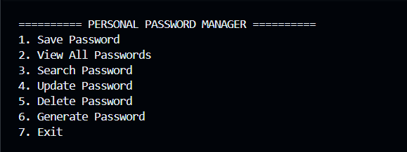
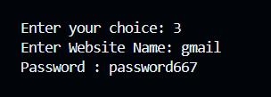
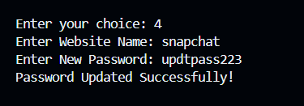
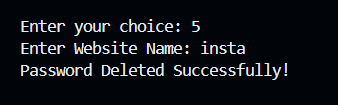
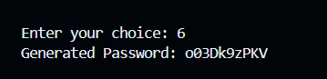

# Personal Password Manager

A simple command-line Password Manager built using Python.

## Features

- Save passwords
- View all saved passwords
- Search passwords by website
- Update existing passwords
- Delete passwords
- Generate secure random passwords
- Automatically saves data to a text file

## Technologies Used

- Python
- File Handling
- Dictionaries
- Functions
- Random Module
- String Module
- Exception Handling

## How to Run

python main.py

## Screenshots

### Main Menu

### Save Password

### View Passwords

### Search Password

### Update Password

### Delete Password

### Generate Password

